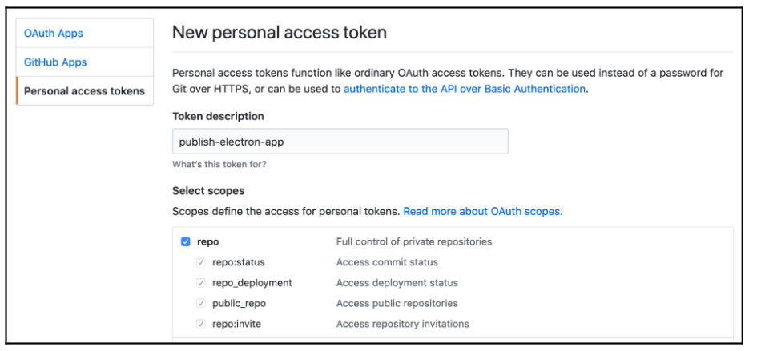

# Minimal Markdown Editor

## Overview

This project demonstrates the development of a minimal Markdown Editor application using **Electron**. The application integrates a third-party editor component and showcases essential features of a modern desktop application.

## Features

1. **Markdown Editing**  
   - Integration with a third-party editor component.
   - Real-time editing and rendering.

2. **Application Menu**  
   - Custom menus to enhance user interaction.

3. **Drag and Drop Support**  
   - Simplified file import using drag-and-drop functionality.

4. **Dynamic Window Management**  
   - Responsive adjustments to fit varying screen sizes.

5. **Automatic Updates**  
   - Configured to publish multiple releases on GitHub.
   - Automatic updates and version management.

6. **Dynamic Application Title**  
   - Title updates based on the context or file being edited.

## Project Structure

- **Main Process**  
  Implements Node.js functionality, including communication with the rendering process and application lifecycle management.
  
- **Rendering Process**  
  Handles UI rendering and interaction using HTML, CSS, and JavaScript.

## Getting Started

### Prerequisites
- Node.js and npm installed.
- GitHub account for repository and release management.

### Installation

1. Clone the repository:
   
```bash
git clone https://github.com/your-username/markdown-editor.git
```

2. Navigate to the project directory:

```bash
cd markdown-editor
```

3. Install dependencies:

```bash
npm install
```

### Running the Application

```bash
npm start
```

## Key Implementation Details

### Configuring a New Project

Initialize the Electron project with `npm init` and configure `package.json`.

### Editor Component Integration

Utilized a third-party Markdown editor for real-time editing.

### Application Menu

Customized the Electron Menu module to include relevant menu items.

### Automatic Updates

- Set up using `electron-updater`.
- Published releases hosted on GitHub.

## Automatic Updates

### Generate PAT

[Creation Link](https://github.com/settings/tokens/new)



### PAT

```

GITHUB_TOKEN=<PAT>
npm run publish

```